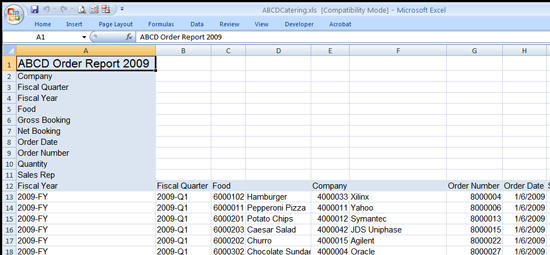
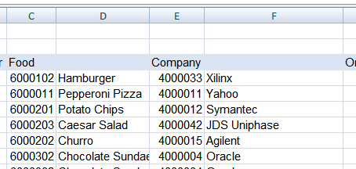
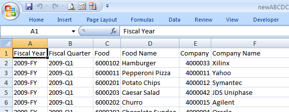

# Cleaning Up Corporate ERP Data


The previous posts have used Excel and Python to create and manipulate small
spreadsheets. In reality, Python and Excel are especially well suited to
tackling large data sets. This post will illustrate some techniques for cleaning
up data downloaded from corporate ERP systems such as SAP and Oracle, and
getting it ready for some serious data mining with Excel.

In this example, a fictional company called ABCD Catering has recorded sales and
order history for 2009 in their corporate ERP system. ABCD Catering provides
catering services to leading Silicon Valley companies, providing the best in
hamburgers, hot dogs, sushi, bibimbap, samosas, churros, sodas and other yummy
food. Your boss has asked you to examine this data and answer some questions and
produce charts representing some of the data:

* What were the total sales in each of the last four quarters?
* What are the sales for each food item in each quarter?
* Who were the top 10 customers for ABCD catering in Q1?
* Who was the highest producing sales rep for the year?
* What food item had the highest unit sales in Q4?

Generating this information typically involves running five separate reports in
the system. Since your boss is looking for this same information at the end of
each quarter, you want to simplify your life and your bosses by automating the
report. Using Python and Excel, you can download a spreadsheet copy of the raw
data, process it, generate the key figures and charts and save them to a
spreadsheet.

Take a look at the data in ABCDCatering.xls:



The spreadsheet contains some header information, then a large table of records
for each order. Each record contains the fiscal year and quarter, food item,
company name, order data, sales representative, booking and order quantity for
each order. The data needs some work before you can use it in a pivot table.
First, the data in rows 1 through 11 must be ignored, it’s meaningless for the
pivot table. Also, some columns do not have a proper header and must be
corrected before the data can be used. The good news is that after some minor
massaging, this data will be ideally suited for processing with a pivot table in
Excel. Close the spreadsheet and get ready to build the reports.

The program begins with the standard boilerplate: import the win32 module and
start Excel. If you have questions on this, please refer to Basic Excel Driving
with Python and Python Excel Mini Cookbook.

```
#
# erpdata.py: Load raw EPR data and clean up header info
#
import win32com.client as win32
import sys
excel = win32.gencache.EnsureDispatch('Excel.Application')
excel.Visible = True
```

Next, open the spreadsheet ABCDCatering.xls with some exception handling. The
try/exceptclause attempts to open the file with the ``Workbooks.Open()`` method,
and exits gracefully if the file is missing or some other problem occurred.
Lastly, the variable ws is set to the spreadsheet containing the data.

```
try:
    wb = excel.Workbooks.Open('ABCDCatering.xls')
except:
    print "Failed to open spreadsheet ABCDCatering.xls"
    sys.exit(1)
ws = wb.Sheets('Sheet1')
```

An easy way to load the entire spreadsheet into Python is the ``UsedRange`` method.
The following command:

```
xldata = ws.UsedRange.Value
```

grabs all the data in the Sheet1 worksheet and copies it into a tuple named
xldata. Once inside Python, the data can be manipulated and placed back into the
spreadsheet with minimal calls to the COM interface, resulting in faster, more
efficient processing.

To delete rows, add columns and do other operations on the data, it must be
converted to or copied to a list. The approach used here is to examine the data
row by row, discarding the non essential header rows and copying everything else
to a new list. The first step is to remove the rows that are not part of the
column header row or record data. If you are using Python to generate the
program interactively, you can investigate the data in the xldata tuple and
display the data for the first record (xldata[0]) and header record
(xldata[11]):


The length of both rows is 13, though xldata[0] contains many elements with a
value of None. The following code checks the length of the data and skips any
rows shorter then 13 fields or rows that contain None in the last field. Note
that this code assumes that the actual data in the table always contains
complete records, true in this dataset but you should always understand the
characteristics of the data you’re working on.

```
newdata = []
for row in xldata:
    if row[-1] is not None and len(row) == 13:
        newdata.append(row)
```

The newdata list now contains the header and data rows from the spreadsheet, but
the header row is still not complete. All column headers must contain text in
order to use this data in a pivot table. Unfortunately, the spreadsheet
downloads produced by the ERP system have the column label over the numberical
identifier for the item, while the text column header is blank. You can see that
for the “Food” and “Company” data below.



One approach that works for this data is to scan the header and insert a column
header based on the contents of the previous column. For example, the label for
column F could be “Company Name”, created by simply appending the text ” Name”
to the column header “Company” from the prior column. Using this simple
algorithm, the column header row can be filled out and the spreadsheet made
ready for pivot table conversion. A more complex lookup could be used as well,
but the simple algorithm described here will scale if new fields are added to
the report.

```
for i,field in enumerate(newdata[0]):
  if field is None:
    newdata[0][i] = lasthdr + " Name"
  else:
    lasthdr = newdata[0][i]
```

Now the data is ready for insertion back into the spreadsheet. To enable
comparison between the new data set and the original, create a new sheet in the
workbook, write the data to the new sheet and autofit the columns.

```
wsnew = wb.Sheets.Add()
wsnew.Range(wsnew.Cells(1,1),wsnew.Cells(len(newdata),len(newdata[0]))).Value = newdata
wsnew.Columns.AutoFit()
```

The last step is to save the worksheet to a new file and quit Excel. The Excel
version is checked in order to save the data in the correct spreadsheet format.
Version 12 corresponds to Excel 2007, which uses the .xlsx file extension. You
also have to specify the constant ``xlOpenXMLWorkbook`` to define the type of
output Excel file. Earlier version of Excel use the .xlsextension, and because
the input file was .xls format, no output format specifier is needed for users
of older versions of Excel.

```
if int(float(excel.Version)) >= 12:
    wb.SaveAs('newABCDCatering.xlsx',win32.constants.xlOpenXMLWorkbook)
else:
    wb.SaveAs('newABCDCatering.xls')
excel.Application.Quit()
```

If the file newABCDCatering.xlsx or newABCDCatering.xls already exists in My
Documents, you will see the following popup when you run the script.


Click “Yes” to overwrite the spreadsheet file. To run the script cleanly, erase
the file newABCDCatering.xlsx or newABCDCatering.xls and try the script again.

After running the script, open the file newABCDCatering.xlsx or
newABCDCatering.xls and view the contents. Note that the extraneous header
information has been removed and blank column header information has been
inserted programmatically as described earlier.



The new spreadsheet is ready for use in a pivot table, which will be covered in
the next post. Here is the complete script, also available at [https://github.com/pythonexcels/examples/blob/master/erpdata.py](https://github.com/pythonexcels/examples/blob/master/erpdata.py)

```
#
# erpdata.py: Load raw EPR data and clean up header info
#
import win32com.client as win32
import sys
excel = win32.gencache.EnsureDispatch('Excel.Application')
#excel.Visible = True
try:
    wb = excel.Workbooks.Open('ABCDCatering.xls')
except:
    print "Failed to open spreadsheet ABCDCatering.xls"
    sys.exit(1)
ws = wb.Sheets('Sheet1')
xldata = ws.UsedRange.Value
newdata = []
for row in xldata:
    if len(row) == 13 and row[-1] is not None:
        newdata.append(list(row))
lasthdr = "Col A"
for i,field in enumerate(newdata[0]):
    if field is None:
        newdata[0][i] = lasthdr + " Name"
    else:
        lasthdr = newdata[0][i]
wsnew = wb.Sheets.Add()
wsnew.Range(wsnew.Cells(1,1),wsnew.Cells(len(newdata),len(newdata[0]))).Value = newdata
wsnew.Columns.AutoFit()
if int(float(excel.Version)) >= 12:
    wb.SaveAs('newABCDCatering.xlsx',win32.constants.xlOpenXMLWorkbook)
else:
    wb.SaveAs('newABCDCatering.xls')
excel.Application.Quit()
```

## Prerequisites

Python (refer to [http://www.python.org](http://www.python.org))

Win32 Python module (refer to [http://sourceforge.net/projects/pywin32](http://sourceforge.net/projects/pywin32))

Microsoft Excel (refer to [http://office.microsoft.com/excel](http://office.microsoft.com/excel))

## Source Files and Scripts

Source for the program erpdata.py and spreadsheet file ABCDCatering.xls are
available at [http://github.com/pythonexcels/examples](http://github.com/pythonexcels/examples) 

Originally posted on November 2, 2009
