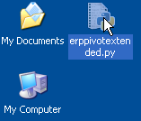
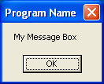
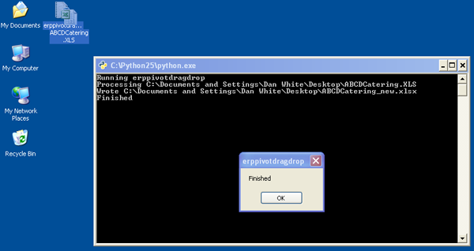
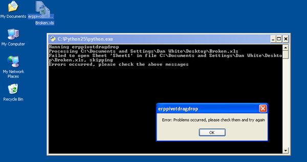

# A User Friendly Experience


Let’s be honest for a second, when was the last time you saw a Windows user
running something from the command prompt? Well, I do it occasionally, but I
can’t say I remember seeing a non-IT person using the command prompt recently.
So if you’re going to offer your users a Windows program, you better give them
an icon to click and let them drag stuff onto it. And if something goes wrong,
you better have a decent error message. This post will take the Pivot Table
generation script developed in the Extending Pivot Table Data post and turn it
into a user friendly Windows program with better flexibility and improved user
experience.

The scripts developed previously could be run at the command line or by double
clicking on the icon for the script line this.




This works because the input file name, ABCDCatering.xls, is hard coded within
the script. In the real world, your users have folders containing dozens of
randomly named spreadsheets. If a user accidentally provides a corrupt
spreadsheet, the program should keep cranking through the other files and let
the user recover the damaged file later. The script developed in the last post
needs some enhancements to make it more user friendly, including:

* Provide support for multiple randomly named input spreadsheets
* Add some simple message boxes and drag-and-drop support
* Improve the error checking and error recovery to give the user feedback when something goes wrong

To keep things concise, this version of the script only allows the user to run
the program by dragging and dropping files onto the program icon. Enhancing the
script to also support command line operation is left as an exercise for the
user. Let’s work through each of the usability issues below:

## Multiple File Support

As I mentioned, Windows XP/Vista/7 users typically don’t interact with the
command prompt. Instead, programs are run by clicking on their icons, either
from the desktop, a folder, or the Start menu. A user specifies spreadsheets or
document files by opening them in the application or dragging them onto the
program icon on the desktop or in the Explorer window. You can also add the file
names after the program name at the command prompt if needed.

To process multiple files, the program needs to process command line args, which
are already conveniently available in the sys.argv list. Note that the first
argument sys.argv[0] is used for the script name. The runexcel function is
modified to pass sys.argv to the runexcel function, which loops through each of
the input files.

```
if __name__ == "__main__":
    runexcel(sys.argv)

for fname in args[1:]:
    # Process spreadsheet files
```

The for loop wraps the ``wb = excel.Workbooks.Open(fname)`` call, the ``wb.SaveAs()``
call, and everything in between so each workbook is processed within the loop.
After the loop finishes, a check for errors is made. If any errors occurred a
warning and message box are issued.

## Primitive GUI Support

Adding message boxes and providing basic drag-and-drop support adds a level of
familiarity for Windows users. Python supports a large number of GUI frameworks,
see
[http://wiki.python.org/moin/GuiProgramming](http://wiki.python.org/moin/GuiProgramming)
for a comprehensive list. Building a complete graphic interface for this script
is beyond the scope of this article, and isn’t really necessary anyway. Instead,
you can add support for simple message boxes using the MessageBoxA function
built into Windows. The basic pattern for calling a message box using this
technique is to import ctypes and call ``windll.user32.MessageBoxA``:

```
from ctypes import *
windll.user32.MessageBoxA(None,"My Message Box","Program Name",0)
```

This simple code produces a message box with the text “My Message Box”, an OK
button, and “Program Name” as the top banner. When Python encounters
``windll.user32.MessageBoxA()``, program execution pauses until the user clicks
the OK button.



## Improve Error Checking

Lots of problems can happen when reading user spreadsheet data. The user can
forget to specify an input file. They could try to have the script read a Word
document or other non-spreadsheet file type. The spreadsheet might be corrupted.
You need to bulletproof your script and guard against potential issues, both
known and unknown.

Previous versions of the script made limited use of the try/except pattern to
catch errors.

```
try:
    wb = excel.Workbooks.Open('ABCDCatering.xls')
except:
    print "Failed to open spreadsheet ABCDCatering.xls"
    sys.exit(1)
```

erppivotdragdrop.py makes more liberal use of try/except, wrapping more of the
program code in the try block. If an error occurs, it can be handled more
cleanly with nice warning messages. The downside of using try/except is that you
lose the traceback message telling you where the error occurred. To get this
information back, use the traceback module and the
``traceback.print_exc()`` function. One usage is to call ``traceback.print_exc()`` in the
except block like this:

```
import traceback
try:
  a = 1/0
except:
  # Do error recovery
  traceback.print_exc()
```

Now exceptions are caught, handled, and a more detailed traceback is still available.

## Running the script

Let’s test out the script. First, copy the script to the desktop and drag the
ABCDCatering.xls spreadsheet onto the icon. Python starts running in the command
window and begins processing the file you dragged. If everything ran
successfully, you’ll see a series of messages and the “Finished” message box.



If a problem occurred, a message is displayed in the command window. At the end
of the run, the message box is displayed letting you know that something bad
happened and that you should review the error messages.



The completed script is too long to reproduce here, please go here to view the
complete script.

## Prerequisites

Python (refer to [http://www.python.org](http://www.python.org))

Win32 Python module (refer to [http://sourceforge.net/projects/pywin32](http://sourceforge.net/projects/pywin32))

Microsoft Excel (refer to [http://office.microsoft.com/excel](http://office.microsoft.com/excel))

## Source Files and Scripts

Source for the program erppivotextended.py and spreadsheet file ABCDCatering.xls
are available at [http://github.com/pythonexcels/examples](http://github.com/pythonexcels/examples)

Originally posted on February 7, 2010
