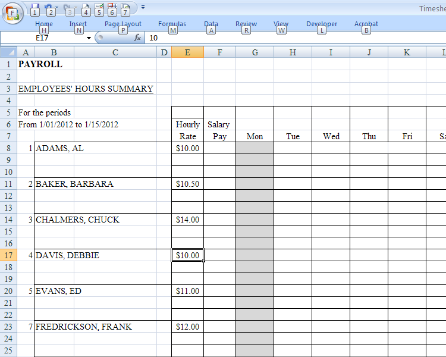

# Ninety Six Spreadsheets

Thank goodness for Python. My wife and restaurant owner L asked me this morning,
“Honey, can you give me the history of raises for Steve Smithfield and Jeff
Johnson”. I told her I’ll look into it, and thought how I might use Python to
tackle the problem.

I have the entire history of payroll captured across ninety six spreadsheets,
one for each pay period.



To manually click through each spreadsheet, locate the pay rate for the Steve
and Jeff, write it down, and go to the next spreadsheet would take about 30
seconds per spreadsheet, or almost 50 minutes. I decided to invest 10 minutes in
a Python script I could use over and over. The script basically opens every .xls
file in the local directory and creates a list of employee names in the
spreadsheet. If Steve or Jeff are found in the list, their salary is appended to
a list. After all the spreadsheets are read, the script prints out the results.
The spreadsheets are named “Timesheet_20120101.xls” for January 1, 2012,
“Timesheet_20120515.xls” for May 15, 2012, etc.

Here is the completed script

```
#
# Report payrates for two employees across multiple spreadsheets
#
import win32com.client as win32
import glob
import os

xlfiles = sorted(glob.glob("*.xls"))
print "Reading %d files..."%len(xlfiles)

steve = []
jeff = []
cwd = os.getcwd()
excel = win32.gencache.EnsureDispatch('Excel.Application')
for xlfile in xlfiles:
    wb = excel.Workbooks.Open(cwd+"\\"+xlfile)
    ws = wb.Sheets('PAYROLL')
    xldata = ws.UsedRange.Value
    names = [r[1] for r in xldata]
    if u'SMITHFIELD, STEVE' in names:
        indx = names.index(u'SMITHFIELD, STEVE')
        steve.append(xldata[indx][4])
    else:
        steve.append(0)

    if u'JOHNSON, JEFF' in names:
        indx = names.index(u'JOHNSON, JEFF')
        jeff.append(xldata[indx][4])
    else:
        jeff.append(0)
    wb.Close()


print "File,Jeff,Steve"
for i in range(len(xlfiles)):
    print "%s,%0.2f,%0.2f"%(xlfiles[i],jeff[i],steve[i])
excel.Application.Quit()
```
   
Originally Posted on September 22, 2012

